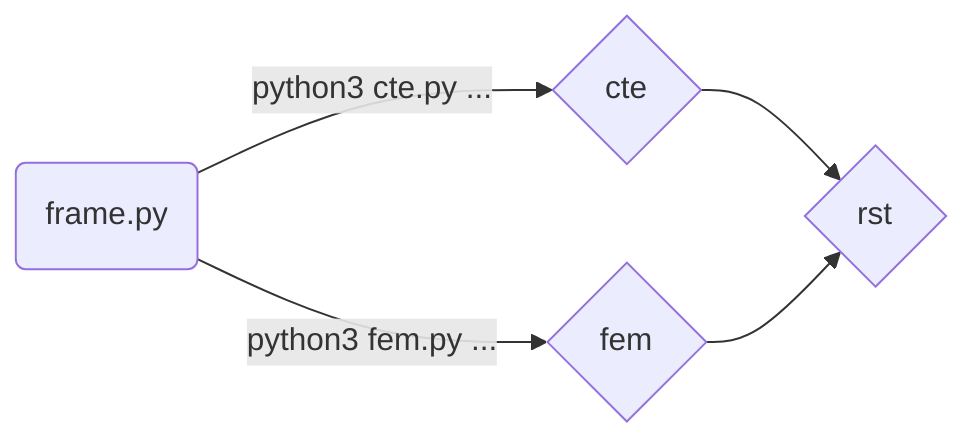
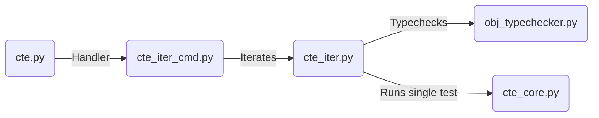
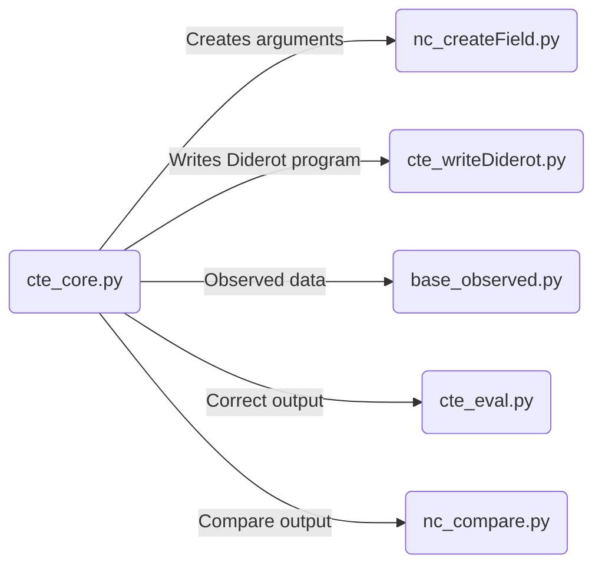


# Overview of Repo
 - A. Functions and Operators
	 - A1. Function composition : [fn_composition](https://github.com/cchiw/latte/tree/master/fn_composition "fn_composition")
	 - A2. Function concatenation :[fn_concatenation](https://github.com/cchiw/latte/tree/master/fn_concatenation "fn_concatenation")
	 - A3. Matrix Inverse: [fn_matrixInverse](https://github.com/cchiw/latte/tree/master/fn_matrixInverse "fn_matrixInverse")
	 - A4. Min and Max :[fn_min-max](https://github.com/cchiw/latte/tree/master/fn_min-max "fn_min-max")
	 - A5. Clerp and Clamp:[fn_clerp](https://github.com/cchiw/latte/tree/master/fn_clerp "fn_clerp")
	 - A6. Field Selection:[fn_selection](https://github.com/cchiw/latte/tree/master/fn_selection "fn_selection")
- B. Tools
	- B1. DATm: Diderot’s Automated Testing:[tool_DATm](https://github.com/cchiw/latte/tree/master/tool_DATm "tool_DATm")
	- B2. Printing the intermediate representation: [tool_printIR](https://github.com/cchiw/latte/tree/master/tool_printIR "tool_printIR")
- C. Field Definitions
	- C1. Closed Form expressions:[dfn_cfe](https://github.com/cchiw/latte/tree/master/dfn_cfe "dfn_cfe")

# A.Functions and Operators
## A1. Function composition
Given two fields
```
field#k(d1)[α]F0;
field#k(d0)[d1]F1;
```
A user might want to use the result of one field to probe the other, also known as field composition
```
tennsor[α] t = F0(F1(x));
```

The problem with ^ is that the result is a tensor (and no longer differentiable). Instead, added a field composition operator that can be applied to differentiable fields.

```
field#k(d0)[α]G = F0 ∘ F1;
```

There is a type restriction on this type of operation:

> field#k(d1)[α]× field#k(d0)[d1] → field#k(d1)[α]
>The second argument is a vector field, whose length is the dimension of the first argument.

The function name  "compose" can also be used

```
field#k(d0)[α]G = compose(F0,F1);
```
The field arguments can be created as the result of another operation.

```
field#k(d0)[α]G = compose(F0, A∙B);
```

> **Note:** The result of (A∙B) must still fit the type requirements mentioned earlier

The user might want to chain multiple composition operators:
```
field#k(d0)[α]G = F0 ∘ F1∘ F2;
```
> **Note:** The new field variable F2 will have to meet the same type  requirements mentioned earlier

### Details
* Branch: [Diderot-Dev](https://github.com/cchiw/Diderot-Dev)
* Syntax: "compose"  and "◦"
	- field#k(d1)[α]× field#k(d0)[d1] → field#k(d1)[α]
* Text: EIN IR design, rewriting rules, and resolved bugs listed in Doc
* Examples Directory : [fn_composition](https://github.com/cchiw/latte/tree/master/fn_composition "fn_composition")

----------
----------
## A2. Function concatenation
Given two fields
```
field#k(d)[i] A;  field#k(d)[i] B;
```

A user might want to put two fields together to create a new field

```
field#k(d)[2,i] M = concat(A,B);
```

> **Note:** The two fields have the same type

### Details
* Branch: [Diderot-Dev](https://github.com/cchiw/Diderot-Dev)
* Syntax: "concat"
	- field#k(d)[α] × field#k(d)[α] → field#k(d)[2,α]
* Text: Mentioned in dissertation-FW. Details provided in Doc
* Future work Use syntax “[”,“]”
* Examples Directory: [fn_concatenation](https://github.com/cchiw/latte/tree/master/fn_concatenation "fn_concatenation")
----------
----------
## A3. Matrix Inverse
Given matrix M and a second order tensor field F
```
tensor[d,d] M;
field#k(d)[d,d] F;
```

A user can take the matrix inverse

```
tensor[d,d] MI = inv(M);
field#k(d)[d,d] FI = inv(F)
```

> **Note:** The two fields have the same type

### Details
* Branch: [Diderot-Dev](https://github.com/cchiw/Diderot-Dev)
* Syntax: “inv()”
	- field#k(d)[d,d] → field#k(d)[d,d]
	- tensor[n,n] → tensor[n,n]
* Text: Mentioned in dissertation-Design
----------
----------
## A4. Min and Max

Given two scalar fields
```
field#k(d)[] A; field#k(d)[] B;
```
A user can compare them by taking the maximum and minimum
```
field#k(d)[] F = MaxF(A,B);
field#k(d)[] G = MinF(A,B)
```
Then take the derivative
```
field#k-1(d)[d] F = ∇ Max(A,B);
```

### Details
* Branch: [Diderot-Dev](https://github.com/cchiw/Diderot-Dev)
* Syntax: “MaxF” and "MinF"
	-  field#k(d)[] ×  field#k(d)[] →  field#k(d)[]
* Future work: change "MaxF()" to just "Max()”
* Examples Directory [fn_min-max](https://github.com/cchiw/latte/tree/master/fn_min-max "fn_min-max")
----------
----------
## A5. Clerp and Clamp

It is typical for a  user to use clamp and lerp sequentially and on scalars
```
vec2 a; vec2 b; real t;
real xx = clamp(a[0], b[0], lerp(a[0], b[0], t));
real yy = clamp(a[1], b[1], lerp(a[1], b[1], t));
vec2 out = [xx,yy];
```
We addressed this issued in two ways. The first was to allow non-scalar arguments to math functions clamp() and lerp()

```
vec2 out = clamp (a, b, lerp(a, b, t))
```
The second was to create the new clerp() function
```
vec2 out = clerp (a,b,t)
```
which will apply clamp and lerp as expected.

### Details
* Branch:  [Vis15](http://smlnj-gforge.cs.uchicago.edu/scm/viewvc.php/branches/vis15/?root=diderot) & [Diderot-Dev](https://github.com/cchiw/Diderot-Dev)
* Syntax: “clerp()” New Clerp function
	- tensor[i] × tensor[i] × real → tensor[i]
	- tensor[i] × tensor[i] × real × real × real → tensor[i]
* Syntax: “clamp()” Clamp function can be applied to general tensors
	- tty = tensor[α]
	- tty × tty × tty → tty
* Examples directory: [fn_clerp](https://github.com/cchiw/latte/tree/master/fn_clerp "fn_clerp")
----------
----------
## A6.Field Selection

Inside a Diderot program there may be many different field definitions and computations on those fields
```
field#k(d)[α] A; field#k(d)[α] B; field#k(d)[α] C;  field#k(d)[α] D;...
```
Typically, this meant that the Diderot programmer would comment some lines in and out and recompile when trying different definitions. To make it easier we created a new function "swap()" that alternates between different field definitions based on the *selection_id.*
```
int selection_id;
field#k(d)[] F = swap(selection_id,A,B,C,D);
```
As a note, the selection_id can also be an input variable.
```
input int selection_id;
```
### Details
* Branch: [Diderot-Dev](https://github.com/cchiw/Diderot-Dev)
* Syntax: “swap()"
	- fty = field#k(d)[α]
	- int × fty × fty → fty
	- int × fty × fty× .... → fty
	- int × fty × fty × fty × fty × fty × fty → fty
* Arguments
	- *Selection id* The first argument  is an integer that serves to select a field. i.e. id=2 chooses the second field argument
	- *Field arguments* The function accepts 2-6 field arguments.
* Potential issue:  The value of the *Selection id* is clamped. If the first argument is id=-7 the id is set to 1 instead of throwing an error
* Examples directory: [fn_selection](https://github.com/cchiw/latte/tree/master/fn_selection "fn_selection")
# B.Tools
## B1. DATm: Diderot's Automated Testing

### Details
* Use: Test operators on and between tensors/image data based on correctness
* Tool: DATm:Diderot’s Automated Testing tool
* Text: [ICSE-AST paper]([https://www.researchgate.net/publication/317836930_DATm_Diderot%27s_Automated_Testing_Model](https://www.researchgate.net/publication/317836930_DATm_Diderot%27s_Automated_Testing_Model)) and Testing chapter in [Dissertation]([http://pl.cs.uchicago.edu/documents/chiw_dissertation.pdf](http://pl.cs.uchicago.edu/documents/chiw_dissertation.pdf))
	> Testing environment variables in Pg 102
	> Adding a new operator in Pg 113

### Getting Started
Quick instructions
1. Checkout github directory for  [DATm]([https://github.com/cchiw/DATm.git])
	> git clone https://github.com/cchiw/DATm.git
2.  Change ``cpath`` in Frame to your absolute path to diderot branches. See *Set Up* 
3.  Starting Testing with command line arguments. See *Running DATm*
	> python3 cte.py 1 0

  

### Set Up:  variables and testing frame settings

* **Change branch** being tested :
	Comment in the right ```s_branch``` variable in Frame

	```
	#s_branch  = branch_vis15;
	s_branch = branch_dev;
	#s_branch = branch_chiw17
	```
	or add a new branch name in ```branch_other = "*/"``` in *shared/base_constants.py*

* Change **type of search** for test cases:

	For an **exhaustive testing** approach, set variable  ```s_random_range = 0 ```  in Frame. For **randomized testing** set the variable to x  ``s_random_range= x``, where the probability of a single test case being generated is  1  in x+1.

*  Change variables in the **testing environment:**

	You can comment in and out variables in Frame. This includes variables to change the coefficient order, number of samples, number of operators, type of arguments,..

	> More details in Pg 102 in [Dissertation](http://pl.cs.uchicago.edu/documents/chiw_dissertation.pdf),

  

### Running DATm: command-line commands and scope

The testing environment is indicated by the frame. The scope helps target a specific operator, test, or family of programs.
- Run everything:
	> python3 cte.py 0
- Test a single operator:
	> python3 cte.py 1 id #where id is a number

  

###  Results passes/fails
Great, everything is running now, but how do I look at the results? In the directory rst/stash are several text files that record the test cases.
* *results_final.txt*:Testing frame and the results of each test case
* *results_terrible.txt:* Reports test cases with errors
* *results_ty.txt*:Test labels and Types
	>*Note* that each test case has a label of the form "p_o...l2"

###  Targeted testing
Rerun tests (group of tests) that failed.
For instance, the test case(s) with label

> “p_o27_o0_t0_tN_tN_l2”

can rerun with command
> python cte.py 3 27 0 0,

where “3” is the number of arguments and "27 0 0” refer to the integers in the label before “tN

## Development
Adding a new operator to DATm:
1. Add to operator constant: *shared/obj_operator.py*
2. Add case to type-checker: *shared/obj_typechecker.py*
3. Add way to evaluate that operator applied to polynomials: *nc/nc_eval.py*
	> More details in Pg 113 in  [Dissertation](http://pl.cs.uchicago.edu/documents/chiw_dissertation.pdf)

  

  

## Organization and flow

### Command line arguments



### Iterate over test cases



###  Single Test case



## B2. Printing the intermediate representation
Translate our compiler's intermediate representation (EIN) into a readable latex or unicode format.

Derivations by hand can be tedious and error-prone. To address that issue we support a higher-order notation.  For instance, consider the following Diderot code

```
image(2)[] a;  image(2)[] b;
field#4(2)[]A = a⊛u;  field#4(2)[]B = b⊛v;
field#4(2)[]G = (A*V)/B;
output tensor[3] out =  ∇⊗(G)(pos);
```
> *Note* that that the image type is defined separately. These are the variable names that will be used when printing out the IR.

The differentiation operations ∇⊗∇ are distributed across the tensor operations defined in filed type G. Internally, Diderot's rewriting system applies tensor calculus based rewrites that will distribute the differentiation operation. The user can print out the intermediate representation after the rewriting stage with command line arguments:

>Diderot-Dev/bin/diderotc --readEin3 T.diderot

$$\rightarrow_{refactor}(\frac{((a* \nabla  \otimes v)+((v \otimes  \nabla a)))}{b}-\frac{(a*(v \otimes  \nabla b))}{((b)^2)})$$
To see multiple rewriting options we can use command --readEinRewrite:
>Diderot-Dev/bin/diderotc --readEinRewrite T.diderot

$$\rightarrow_{flat} (\frac{-((a*(v \otimes  \nabla b)))}{((b)^2)}+\frac{(a* \nabla  \otimes v)}{b}+\frac{((v \otimes  \nabla a))}{b})$$$$\rightarrow_{match}(\frac{-((a*(v \otimes  \nabla b)))}{((b)^2)}+\frac{(a* \nabla  \otimes v)}{b}+\frac{((v \otimes  \nabla a))}{b})$$$$\rightarrow_{refactor}(\frac{((a* \nabla  \otimes v)+((v \otimes  \nabla a)))}{b}-\frac{(a*(v \otimes  \nabla b))}{((b)^2)})$$$$\rightarrow_{pull-division }(((a* \nabla  \otimes v)+((v \otimes  \nabla a)))*\frac{1}{b}-(a*(v \otimes  \nabla b))*\frac{1}{((b)^2)})$$
  
>*Note* There are four rewriting options listed above. The best output can vary by computation. The user can compile the program again and specify a particular rewrite with the command "--readEin" followed by the rewrite number. Thus the command "--readEin3" printed the third rewrite.

>

By default we print out the latex format. However you can use unicode as well.

>Diderot-Dev/bin/diderotc --readEinUni --readEinRewrite T.diderot

## Details
* Branch: [Diderot-Dev](https://github.com/cchiw/Diderot-Dev)
* Run: runs with command line flags
* Format
	* -readEinLatex : latex output (default)
	* -readEinUni : unicode output
* Rewrite call
	* -readEinRewrite : print four steps of rewriting
	* -readEin1, -readEin2, -readEin3, -readEin4: specify a single step of rewriting
* Issues/Future Work
	*  pull out of strands
	* image types needs to be defined separately so we have a unique variable to refer to

# C. Field Definitions
Users can define closed form expressions. The expression can include tensor operators and variables.  Differentiation is applied by differentiating in respect to some variable(s).

## C1. Closed Form expressions 
 It is natural to define a function with an expression: F(x) = $x^2$
In the surface language we added function cfexp() where the first argument exp is an expression and the second x is a variable.
```
tensor [] exp = x*x;
ofield#2(2)[] F = cfexp(exp,x);//define F with variable x
tensor[2] v = [3,7];
tensor[] outF = inst(F,v);//evaluate F with argument v
```
We commonly refer to the right-hand-side to variable F as a cfexp (closed-form expression). The cfe is created with variable x, but is actually evaluated with v.
$$outF= F(v)=  v_0 ^2+  v_1^2$$

The cfexp is a Diderot “ofield” type, but is treated the same as a Diderot "field type". The user can apply other tensor and field operators on the cfexp including differentiation.

```
ofield #1(2)[2] GF = ∇F;
tensor[] outGF = inst(GF,v);
```
The differentiation of the cfexp is computed in respect to the variable v. We illustrate the expected structure below:

  

$$ outGF=  ∇F(v)= \left[ \begin{array}{ll} 2*v_0\\2*v_1  \end{array}\right] $$
A function can be defined with multiple variables, such as
$$F (a, b) = a + b$$
and similarly a cfexp can be defined with multiple variables
```
real[] a = 1; real b = 7;
tensor [] exp = a+b;
ofield#k(d)[] G = cfexp(exp,a);
ofield#k(d)[] H = cfexp(exp,a,b);
ofield#k(d)[] I = cfexp(exp,b);
```
The distinction between G, H, and I is that differentiation is applied in respect to either one or two variables.

$$∇ G_{a}= ∇ a +b $$$$ ∇ H_{ab}= ∇ a +∇ b  $$$$ ∇  I_{b}= a +∇ b$$

  

### Details

* Branch: [Diderot-Dev](https://github.com/cchiw/Diderot-Dev)
* Syntax: “cfexp()"
	- Use an ofield type ofield#k(d)[β], which is the same as a Diderot field but has an "o" in  front of it.
	- Declare a closed form expression with cfexp(exp,v0 ) and evaluate that cfexp with “inst()”
	* “exp” is the core computation that includes operators on and between variables
	* “v0” is the variable we differentiate in respect to. We accept 1-3 “v0” terms
	* cfexp(): tensor[α] × tensor[β] . . . → ofield#k(d)[α]
	* inst(): ofield#k(d)[α] × tensor[β] · · · → tensor[α]
* Text: see [Doc]
* Issues/Future Work:
	* Need to define/initiate all variables before cfexp() is called.
	* OField type doesn’t describe types for multiple inputs, need to change typechecker
	* Remove k-continuity
	*  Needs more extensive testing


