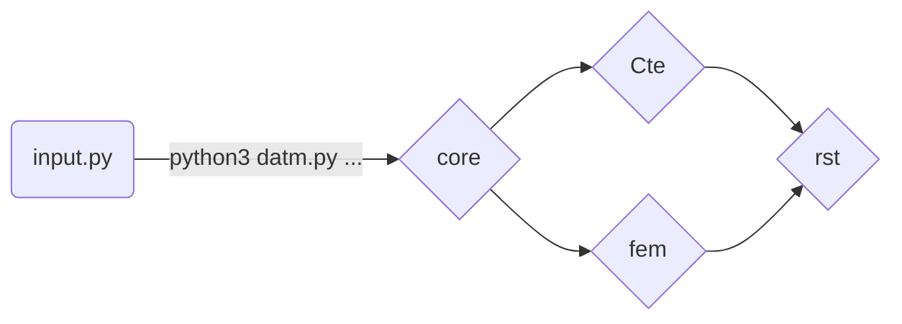
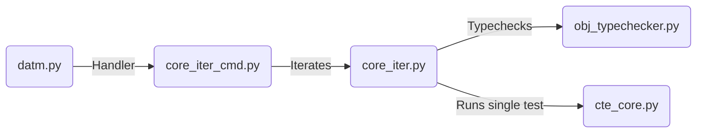

# Tool: DATm: Diderot's Automated testing 
## Details
* Branch:   [Diderot-Dev](https://github.com/cchiw/Diderot-Dev) 
* Use: Test operators on and between tensors/image data based on correctness
* Tool: DATm:Diderot’s Automated Testing tool  
* Text:  [ICSE-AST paper](https://www.researchgate.net/publication/317836930_DATm_Diderot%27s_Automated_Testing_Model) and Testing chapter in [Dissertation](http://pl.cs.uchicago.edu/documents/chiw_dissertation.pdf)
	 > Testing environment variables in Pg 102 
	> Adding a new operator in Pg 113 
## User Guide
### Getting Started
Quick instructions
 1. Checkout github directory for [DATm](https://github.com/cchiw/DATm.git)
	 > git clone https://github.com/cchiw/DATm.git
 2.  Change cpath in Frame to your absolute path to diderot branches. See *Set Up* about other variables you might want to change.
    3.  Starting Testing with command line arguments. See Section on *Running DATm*.
		> python3 datm.py 

### Set Up:  variables and testing frame settings
Settings in the testing process can be changed by commenting in/out variables in the *Frame* (input.py).
* **Change branch**(s_branch) : 
Tell DATm the name of branch being tested. Some branch names are built in(vis15,Diderot-Dev, Chiw17). Comment in the right ```s_branch``` variable in Frame 
	```
	#s_branch  = branch_vis15
	s_branch = branch_dev 
	#s_branch = branch_chiw17
	#s_branch  = branch_other
	```
	or comment in ``branch_other`` and set the variable to a string in *shared/base_constants.py*
    
* **Complexity** (s_layer):
The core computation in a Diderot test program can be simple or more complicated. s_layer indicates the number of operators to apply in a core computation. That number can be 1, 2, or 3.

*  **type of field**(c_pde_test) :
DATm test tensors and fields. The fields can either be made by **nrrd** files or by Firedrake (outside tool to solve **PDE** solutions). For an original Diderot Field types created with nrrd, comment in ``s_field = field_conv``  in the *Frame*. For PDE solutions comment in ``s_field = field_pde`` and change the path in fem/makedefs.gmk.
	```
	s_field = field_conv 
	#s_field = field_pde
	```

* **type of search** (s_random_range)
For an **exhaustive testing** approach, set variable  ```s_random_range```  to 0 in *Frame*. For **randomized testing** set the variable to x  where the probability of a single test case being generated is  1  in x+1.

* **order of coefficients**(s_coeff_style) :
The order of coefficients for the polynomial creating synthetic data. The data can either be linear, quadratic or cubic.
	```
	#s_coeff_style = coeff_linear
	s_coeff_style = coeff_quadratic
	#s_coeff_style = coeff_cubic
	```

*  **testing environment:**
You can comment in and out variables in *Frame*. This includes variables to change the number of samples, type of arguments,..
	> More details in Pg 102 in [Dissertation](http://pl.cs.uchicago.edu/documents/chiw_dissertation.pdf),

### Labels
 * Each test case has a testing *label*
 	> Of the form "p_o1...l2"
### Running DATm: command-line commands and targetting testing
The testing environment is indicated by the *Frame*. The scope helps target a specific operator, test, or family of programs.
-   Run everything:
	> python3 datm.py
    
-   Test a single operator
	> python3 datm.py id # where id is a number
	> *Note* Each operator has a unique id. List printed to screen and copies to rst/stash/results_ops.txt
	
-  Family of computations         
	Rerun (group of) tests by using 1-4 integers from the testing *label*.
	For instance, the label
	
	> “p_o27_o0_t0_tN_tN_l2” 
	
	can rerun with command 
	
	> python datm.py 27 0 0 
	


###    Results passes/fails
Great, everything is running now, but how do I look at the results? In the directory rst/stash are several text files that record the test cases (with *labels*)
 * *results_final.txt*:The results of each test case 	
 * *results_terrible.txt:* Reports test cases with errors  
 * *results_ty.txt*:Test Types used
 * *results_ops.txt*:Operators with ids
## Development
* Adding a new operator to DATm:     
    1. Add to operator constant: *shared/obj_operator.py* 
    2. Add case to type-checker: *shared/obj_typechecker.py*
    3. Add way to evaluate that operator applied to polynomials: *nc/nc_eval.py*
   > More details in Pg 113 in  [Dissertation](http://pl.cs.uchicago.edu/documents/chiw_dissertation.pdf)


## Organization and flow
### Command line arguments

### Iterate over test cases

###  Single Test case


