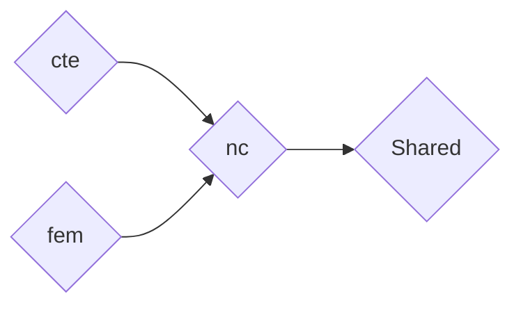
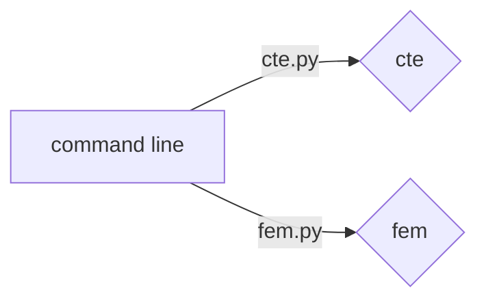
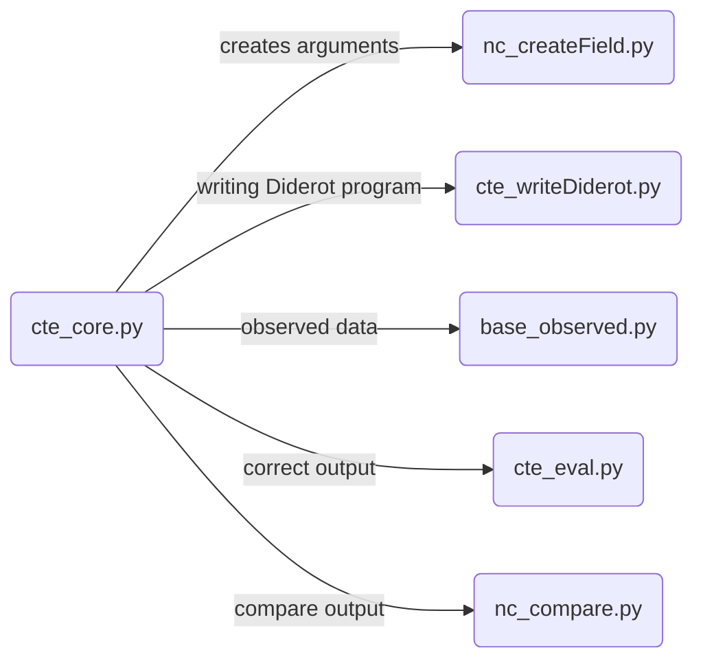

# Tool: DATm: Diderot's Automated testing 
## Details
* Branch:   [Diderot-Dev](https://github.com/cchiw/Diderot-Dev) 
* Use: Test operators on and between tensors/image data based on correctness
* Tool: DATm:Diderot’s Automated Testing tool  
* Text:  [ICSE-AST paper](https://www.researchgate.net/publication/317836930_DATm_Diderot%27s_Automated_Testing_Model) and Testing chapter in [Dissertation](http://pl.cs.uchicago.edu/documents/chiw_dissertation.pdf)
	 > Testing environment variables in Pg 102 
	> Adding a new operator in Pg 113 
## User Guide
### Getting Started
Quick instructions
 1. Checkout github directory for [DATm](https://github.com/cchiw/DATm.git)
	 > git clone https://github.com/cchiw/DATm.git
 2.  Change cpath in Frame to your absolute path to diderot branches. See *Set Up* about other variables you might want to change.
    3.  Starting Testing with command line arguments. See Section on *Running DATm*.
		> python3 cte.py 1 0 

### Set Up:  variables and testing frame settings
* **Change branch** being tested : 
Comment in the right ```s_branch``` variable in Frame 
	```
	#s_branch  = branch_vis15;
	s_branch = branch_dev;
	#s_branch = branch_chiw17
	```
	or add a new branch name in ```branch_other = "*/"``` in *shared/base_constants.py*
    
* Change **type of search** for test cases:
For an **exhaustive testing** approach, set variable  ```s_random_range = 0   ```  in Frame. For **randomized testing** set the variable to x  ``s_random_range= x``, where the probability of a single test case being generated is  1  in x+1.
    
*  Change variables in the **testing environment:**
You can comment in and out variables in Frame. This includes variables to change the coefficient order, number of samples, number of operators, type of arguments,..
	> More details in Pg 102 in [Dissertation](http://pl.cs.uchicago.edu/documents/chiw_dissertation.pdf),

### Running DATm: command-line commands and scope
The testing environment is indicated by the frame. The scope helps target a specific operator, test, or family of programs.
-   Run everything:
	> python3 cte.py 0
    
-   Test a single operator:
	> python3 cte.py 1 id # where id is a number

###    Results passes/fails
Great, everything is running now, but how do I look at the results? In the directory rst/stash are several text files that record the test cases.
* *results_final.txt*:Testing frame and the results of each test case 	
 * *results_terrible.txt:* Reports test cases with errors  
 * *results_ty.txt*:Test labels and Types
	>*Note* that each test case has a label of the form "p_o...l2"
###    Targeted testing           
Rerun tests (group of tests) that failed.
For instance, the test case(s) with   label 
> “p_o27_o0_t0_tN_tN_l2” 

can rerun with command 
> python cte.py 3 27 0 0, 
	
where “3” is the number of arguments and "27 0 0” refer to the integers in the label before “tN
## Development
* Adding a new operator to DATm:     
    1. Add to operator constant: *shared/obj_operator.py* 
    2. Add case to type-checker: *shared/obj_typechecker.py*
    3. Add way to evaluate that operator applied to polynomials: *nc/nc_eval.py*
   > More details in Pg 113 in  [Dissertation](http://pl.cs.uchicago.edu/documents/chiw_dissertation.pdf)


## Organization and flow
### Directory dependence

### Command line arguments

### Flow 


